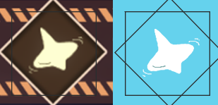
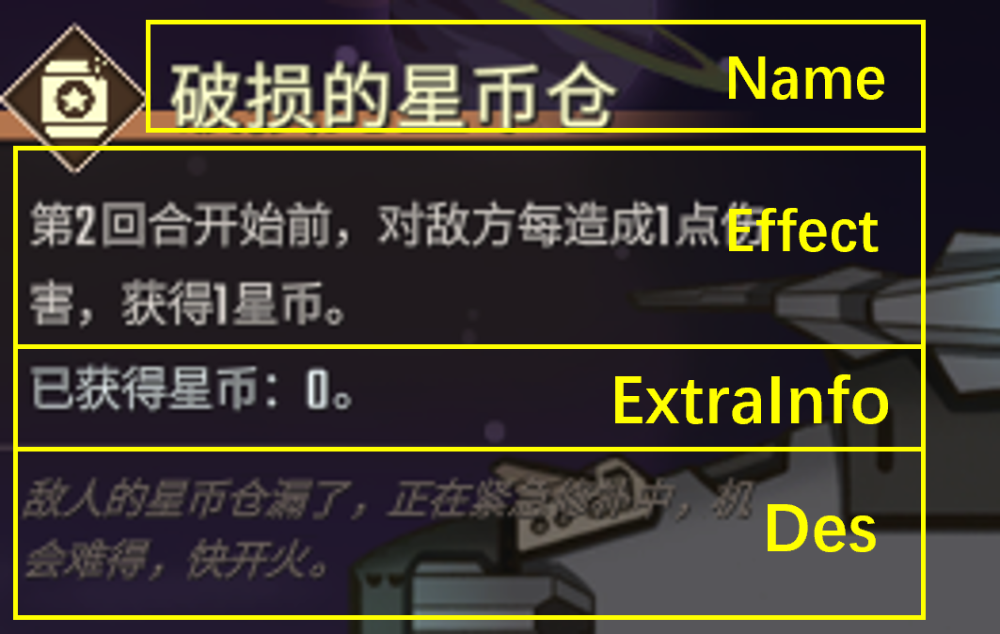
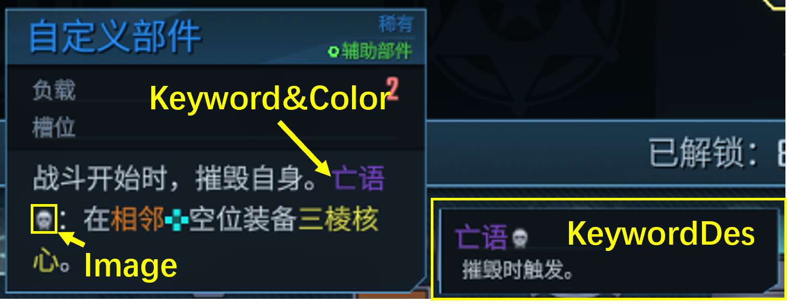

# 添加其他内容

简体中文 [English](Content_EN.md)

本文主要描述如何添加其他内容。如果你还没读过[部件教程](ShipUnit.md)，请先阅读那篇文章。

## 哪些内容可被添加到模组中

以下打勾的内容可以通过csv文件轻松导入游戏（就像部件一样）。未勾选的内容正在施工中...不过你仍然可以绕过csv直接用代码添加这些内容。请参阅[补丁教程](Patch.md)。

- [x] [部件](ShipUnit.md)
- [x] [宝物](#Treasures)
- [x] [天赋](#Talents)
- [x] [驾驶员](#Pilots)
- [ ] 玩家飞船
- [ ] 敌方飞船
- [x] [突发情况](#BattleEvents)
- [x] [关键词及增益](#Keywords)
- [x] [事件及呼叫支援](#Events)
- [ ] 激光皮肤

## 共有字段
大多数内容共有的字段在这里集中列出，而不再单独出现在后面的每项内容中。

- ID: 这件物品的标识符，在你的模组范围内必须是唯一的。
- Name/Name_: 这件物品的名字。
- UnlockLV: 这件物品的解锁等级
    - 大多数情况下指协会等级（0到70）
    - 对于部件，指的是对应飞船的等级（0到10）
- InGame: 设置成FALSE时，禁用\*这件物品
- Pros: 这件物品仅在游玩这些飞船时才会碰到
    - 大船号，或者中途换船不改变飞船的ID
    - 遵循[ID命名法](ShipUnit.md#IDNaming)，也可以指定其他mod的内容。
- WeightOffset: 修改这件物品的出现频率（以百分比形式修改，比如-50减半，100翻倍）
- Description/Description_: 这件物品的描述。
- Args: 这件物品的效果的参数。
- SkillPath: 这件物品的效果的类名。
- SpritePath: 这件物品的图片，不同种类的物品图片大小也不同，会单独标明。

\*禁用：这件物品不能出现在商店或者随机奖励中，也不会出现在图鉴里。但可能出现在事件的固定奖励中，也有可能出现在历史记录中。

## 宝物 <a id="Treasures"></a>

- 文件: Content/Treasure.csv
- 示例: 火神炮 | Vulcan
- 图片大小: 120x120

这件物品独占的参数：

- Rare: 宝物的稀有度，0/1/2分别代表普通/稀有/传说
- GainType: 
    - 0: 正常
    - 1: 只能从商店里买
    - 2: 只能从事件里拿
    - 3: 只能从天赋里刷
    - 4: 初始宝物
    - 5: 禁用的宝物
- OnlyTalent: 这个宝物是哪个天赋的专属宝物
    - 遵循[ID命名法](ShipUnit.md#IDNaming)，也可以指定其他mod的内容。
- Genera: 这个宝物属于哪个类别。你可以分类查找宝物。 
- BattleRelate: 是否战斗相关。（设置中有一个选项在战斗中隐藏无关的宝物）
- AddIn: 在完成第N幕前不会获得此宝物。如果设为0就是从开始即可获得。
- RemoveOut: 在完成第N幕后不会获得此宝物。如果设为0就是直到游戏结束都可获得。

## 突发情况（战斗事件）<a id="BattleEvents"></a>

- 文件: Content/BattleEvent.csv
- 示例: 陀螺雨 | TopRain
- 图像大小: 128x128. 
    - 图片是白色透明底的，最好用PS等工具编辑
    - 在展示的时候，图片的四角是被切掉的（如图），实际展示区域是一个八边形。



这件物品独占的参数：

- Effect/Effect_, ExtraInfo: （看下面）



- BanEnemyIDs: 对战这些敌人时，这个战斗事件不会出现
    - 遵循[ID命名法](ShipUnit.md#IDNaming)，也可以指定其他mod的敌船。
    - 例如：对战炸弹号（ID = 511）时移除陀螺雨，避免让对面显得很呆
- BanPhases: 在对战这些序号的敌人时，这个战斗事件不会出现
    - 从0开始到11结束，例如0是第一幕第一个爪牙，10是第三幕精英
    - 首领战斗不会出现事件
    - 例如在最后一幕（8，9，10）移除陀螺雨，避免让这个事件显得很呆。

## 天赋 <a id="Talents"></a>

- 文件: Content/Talent.csv
- 示例: 多多益善 | CoinGain
- 图像大小: 100x100

这件物品独占的参数：

- Type: 随机天赋是1，固有天赋是2
- InProgress: 设为FALSE时，这个天赋不能在半路上获得（例如变幻方块）
- TalentBanList: 这个天赋与哪些天赋冲突
    - 遵循[ID命名法](ShipUnit.md#IDNaming)，也可以指定其他mod的内容。
    - 冲突是相互的，只用写一边就行了。
- BanEnemyList: 这个天赋与哪些敌人冲突
    - 和上面一样

## 关键词及增益效果 <a id="Keywords"></a>

- 文件: Content/Keyword.csv
- 示例: 亡语 | Deathrattle (只是示例，并没有正确实现)
- 图像大小: 40x40

这件物品独占的参数：

- Keyword/Keyword_: 这些单词出现时会被捕获并高亮
    - 每个单词都要用"\*"扩起来，不同的单词要用";"分割
    - 例如 "\*亡语\*;\*亡语！\*"，这样的话"亡语"和"亡语！"都被视为关键字。
- KeywordDes: 生成一个提示
    - 如果留空，就不会生成提示，只高亮关键词。
- Color: 关键词的颜色
- ImageGroup, Image: 关键词的图标
    - 如果都留空，就没有图标
    - 如果ImageGroup非空，则使用本体游戏中的图标
    - 如果ImageGroup为空，则使用本模组提供的图标
    


### 用关键词生成增益效果
如果你想从关键词生成增益效果并把它们附在部件的右下角（像功率一样），只需要继承`Buff`类，然后把它的`keyWordString`设置为你的`Keyword`，不过这种情况下你得使用`Keyword`而不是`Keyword_`（也就是说需要添加翻译条目）

## 事件及呼叫支援  <a id="Events"></a>

- 文件: Content/EncounterEvents.csv
- 示例: 赌场下注 | Gamble

~~一个大事件可能包含多个选择页面（例如选完一个选项跳转到下一个选择页面），每个选择页面可能包含多个选项，每个选项可能包含多个效果（例如，失去生命的同时，获得星币），也有可能出现概率事件（例如赢下或者输掉赌博）~~

禁止套娃，直接看树状图好了。一般事件结构如下：
```
└─完整事件, 由EventGroup确定，例如赌场事件
    └─选择界面, 由ID确定 (例如一次赌博中，选择赌5毛或者不赌)
        └─选项(Option), 表中每一行是一个选项. (例如赌5毛)
            ├─效果组(ScriptGroup) (支付5毛)
            │   └─效果(Script) (支付5毛)
            └─效果组 (赢或者输)
                ├─效果 (50%: 输了，一毛都没有，事件结束)
                └─效果 (50%: 赢了，单车变摩托，进入下一个选择界面)
```

结合上面的树状图来看这件物品独占的参数：

- ID: 出现在同一个选择界面的所有选项，其ID必须相同
- EventGroup: 出现在同一个完整事件中的所有选项，其EventGroup必须相同
- Days: 这个事件所花费的天数。特殊事件（例如呼叫支援和出现在战斗后的奖励事件）的天数应设为0（影响计划书的触发）
- EnterType: 可选的。如果设为1，将此事件标记为坏事件
    - 进入坏事件时有一个很显眼的红色特效。~~然鹅并没有多少人注意到~~
    - 通常是随机到了坏结果（例如赌输了，或者赌掉血了）
- Tags: 事件的标签，一般来说至少有一个标签，也有可能有多个
    - 1: 部件
    - 2: 宝物
    - 3: 星币
    - 4: 升级
    - 5: 负载（废案，现在没有）
    - 6: 能量原料
    - 7: 维修
    - 8: 商店
    - 9: 护盾
    - 10: 改造
    - 11: 燃料
    - 12: 换位
    - 13: 结束假期（废案，现在没有）
- RaceSpecial: 这个事件是种族专属事件。
    - 1: 人类
    - 2: 智械
    - 3: 兽族
    - 4: 树人
- OptionDes/OptionDes_: 选项的描述
- OptionScript1-3: 效果的类名
- Args1-3: 效果的参数
- Weight1-3: 这个效果在其所在的效果组内被选中的概率
- Group1-3: 这个效果所属的效果组 
    - 每个效果组中的一个效果会被执行
    - 例如有三个效果：
        - S1 (Group1 = 1)
        - S2 (Group2 = 2, Weight2 = 40)
        - S3 (Group3 = 2, Weight3 = 60)
    - 那么S1会最先触发，然后SB (40%) 和 SC (60%) 二选一触发一个。
- Jump1-3: 这个效果结束时跳转到新的页面
    - 遵循[ID命名法](ShipUnit.md#IDNaming)，甚至可以跳到其他模组的事件
    - 如果为空，则结束事件
    - 如果一个选项触发了多个效果，那么最后一个非空的Jump生效
    - 有些效果可能自带多个Jump，例如移除一个部件获得星币时，如果打开对话框后点左下角取消了，就会跳转到另一个页面。~~不仅不给钱还有可能有特殊文本来嘲讽你。~~
    - 也可以用代码修改`option.jumpID`来跳转到任意页面

### 实现自定义效果

继承`OptionContent`类并实现以下几个方法中的一个或多个

- `OnOptionInit`: 预处理描述文本，替换占位符，锁定奖励，隐藏某些选项等
- `Check`: 检查条件，如果不满足则返回false来禁用选项按钮。(例如：没钱买不起的时候)
- `Do`: 执行效果

如果你遵照[基础教程](Start.md#disassemble-the-game-optional)正确提取了游戏文件，有很多示例帮助你定制自己的事件。注意提取的游戏文件中，有些内容的数据类型跟TutorialMod的略有差异，这是因为游戏对模组进行了适配。请以TutorialMod的为准。

### 将事件变为呼叫支援

和添加宝物或部件类似，填一张表即可。

- 文件: Content/BountyEvents.csv
- 例子: Gamble
- 图片大小: 50x50

呼叫支援的ID应该和事件的ID相同。

### 事件的注意事项
- 所有事件都应该有一个安全退出的路线，避免出现死路或者死循环。
- 呼叫支援和特殊事件应该把InGame设为`FALSE`，Days设为0。度假事件应该消耗2，3或4天
- 呼叫支援结束时，使用`OC_SetBountyFinished`效果消耗支援次数并触发宝物效果。
- 按照惯例，呼叫支援应该包含一个不消耗次数的退出选项，避免玩家手滑点错了被迫开支援。也就是说有一个选项不调用`OC_SetBountyFinished`直接退出。
- 由于UI的限制，每个选择界面最多只能有6个选项（包括隐藏的选项），其中最多只能有5个显示（包括变灰的选项）

## 驾驶员 <a id="Pilots"></a>

- 文件: Content/Pilot.csv
- 示例: 皮皮 | Pip
- 图像大小: 512x512

这件物品独占的参数：
- PilotTitle/PilotTitle_ & PilotName/PilotName_: 这个驾驶员的称号和名字
- Race: 这个驾驶员的种族（注意这里的数字比专属事件中的数字少1）
    - 0: 人类
    - 1: 智械
    - 2: 兽族
    - 3: 树人
    - 9: 全部
- Talent: 这个驾驶员的固有天赋
    - 遵循ID命名法，也可以指定其他mod的内容。
- RandomSlotNum: 这个驾驶员生成时拥有这么多个随机天赋（一般是2个）
- Remark: 注释，可以写固有天赋的效果。没有实际作用
- PilotMonologue: 驾驶员对话的类名
    - 继承`PilotMono`类，然后编写何时何地触发何种对话
    - 驾驶员对话和宝物技能很类似，不过它们需要手动安装监听器(listeners)
    - 如果你正确[提取游戏文件](Start.md#disassemble-the-game-optional)了的话，里面有很多形如`PM_<PilotID>`的示例 (例如`PM_10000`)
    - 如果留空，则没有驾驶员对话。
