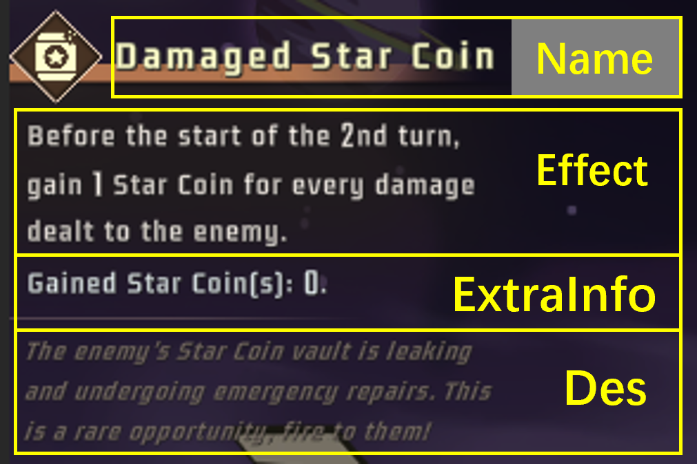
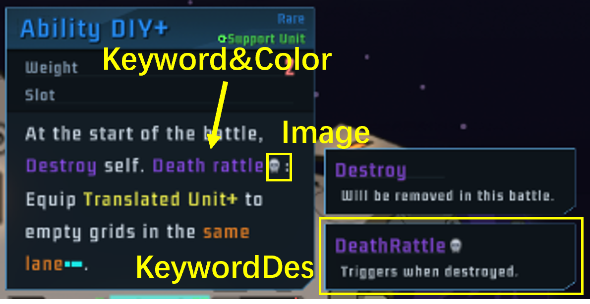

# Other Contents

This page tell you the details on how to add other contents to your mod. If you haven't read [Units](ShipUnit_EN.md) page, please read that first.

## What content can be added to your mod:

The following checked items can be easily added to your mod with csv (similar to Units). The unchecked ones are working in progress (WIP) and cannot be added in such a way. However, you may still add them by writing [Patches](Patch_EN.md). 

- [x] Units
- [x] Treasures
- [x] Talents
- [ ] Pilots
- [ ] Player Ships
- [ ] Enemy Ships
- [x] Emergency Events
- [x] Keywords & Buffs
- [ ] Events & Call For Supports
- [ ] Laser Skins

## Common fields
These are common fields that most types of contents share.

- ID: String. Must be unique in your mod.
- Name/Name_: Display name of this item.
- UnlockLV: 
    - In most cases: Association Lv required to enable this item. (0-70)
    - For Units: Ship Lv required to enable this item. (0-10)
- InGame: Set to `FALSE` to disable* this item.
- Pros: This item is enabled exclusive to target ship.
    - Mega-ship counts as the original ship.
    - If element numerical, refers to a ship in vanilla game;
    - If element in the format: `<ModID>.<ShipID>`, refers to a ship in another mod;
    - Otherwise: element refers to a ship in this mod.
- WeightOffset: Set this value to make this item appear X% more or less frequently.
- Description/Description_: Item descriptions.
- Args: Arguments of ability.
- SkillPath: Name of the ability class.
- SpritePath: Image of this item.

\*Disabled: Can't appear in shop or random rewards, but may appear as a fixed reward of an event or in a historical save. Doesn't appear in the encyclopedia.

## Treasures

- File: Content/Treasure.csv
- Example ID: Vulcan
- Sprite Size: 120x120

Fields exclusive to this item:

- Rare: 0 for common, 1 for rare, 2 for legendary.
- GainType: 
    - 0: Enabled.
    - 1: Only available from shops.
    - 2: Only available from events.
    - 3: Only available from talents.
    - 4: Only appear as initial items.
    - 5: Disabled.
- OnlyTalent: This treasure is enabled only if target talent is present. (Making it an pilot exclusive treasure.)
    - If numerical, refers to a talent in vanilla game;
    - If in the format: `<ModID>.<TalentID>`, refers to a talent in another mod;
    - Otherwise: refers to a talent in this mod.
- Genera: Categorize some treasures to smaller groups for tag searching. 
- BattleRelate: Deprecated. Has no effect.
- AddIn: This treasure is disabled until you finish the first Xth galaxy. If set to 0, available from the start.
- RemoveOut: This treasure is disabled when you finish the Xth galaxy. If set to 0, available till the end.

## Emergency Events

- File: Content/BattleEvent.csv
- Example ID: TopRain
- Sprite Size: 128x128. 
    - The image is white and transparent by default.
    - The image has corners cut when displayed, as is shown in the image below. The displayed area is an octagon.

Fields exclusive to this item:

- Effect/Effect_, ExtraInfo: (See the image below)

- BanEnemyIDs: This event won't appear when facing listed enemies. 
    - If element numerical, refers to an enemy in vanilla game;
    - If element in the format: `<ModID>.<EnemyID>`, refers to an enemy in another mod;
    - Otherwise: element refers to an enemy in this mod.
    - Eg. adding 511 to BanEnemyIDs will make `TopRain` no longer appear at Bomber, preventing it from being too trivial.

- BanPhases: This event won't appear in listed battles. 
    - 0 = first battle, 11 = final boss
    - Boss battles have no emergency events.
    - Eg. Adding 8, 9, 10 to BanPhases will make `TopRain` no longer appear in the last galaxy, where it has very little effect.

## Talents

- File: Content/Talent.csv
- Sprite Size: 100x100

Fields exclusive to this item:

- Type: 1 for Random Talents, 2 for Inherent Talents
- InProgress: set to FALSE to make this talent only available at game start. (Eg. Shifting Block)
- TalentBanList: This talent conflicts with listed talents.
    - If element numerical, refers to a talent in vanilla game;
    - If element in the format: `<ModID>.<TalentID>`, refers to a talent in another mod;
    - Otherwise: element refers to a talent in this mod.
    - Relationship is mutual.
- BanEnemyList: This talent conflicts with listed enemies.
    - Same as above.

## Keywords

- File: Content/Keyword.csv
- Example ID: DeathRattle
- Sprite Size: 40x40 (WIP)

Fields exclusive to this item:

- Keyword/Keyword_: A set of keywords to be highlighted. 
    - Each of them should be embraced by "\*" and separated by ";" 
    - Eg. "\*DeathRattle\*;\*Death rattle\*"
- KeywordDes: Creates a tooltip.
    - If left blank, there will be no tooltips. (Only highlights the keyword.)
- Color: Color of the highlighted keyword.
- ImageGroup, Image: The icon attached to the keyword.
    - If both blank, no icon.
    - If ImageGroup is not blank, use the icon from vanilla game.
    - If ImageGroup is blank, use the icon provided by your mod.
    

