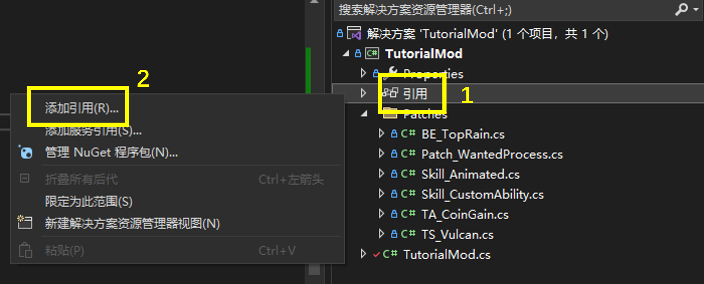
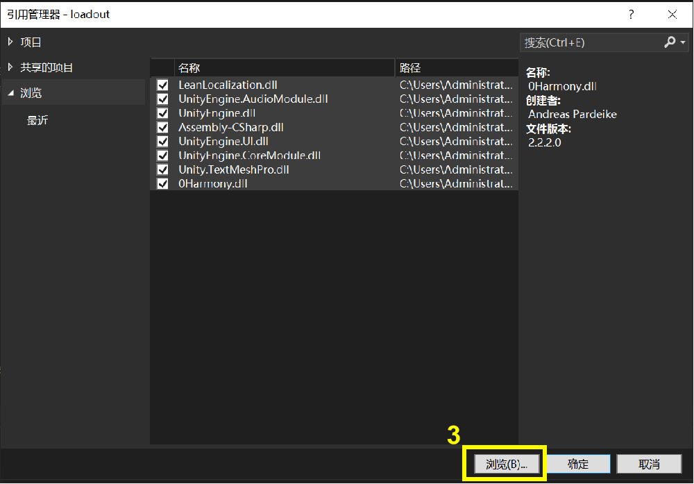

# 补丁教程（修改代码）

简体中文 [English](Patch_EN.md)

所谓打补丁（Patching），通俗的讲就是改代码。本文介绍如何修改游戏逻辑。

开始之前，请确保你的设备上已安装Visual Studio
- 推荐安装2022版本及以上
- 从这个[链接](https://visualstudio.microsoft.com/downloads/)下载
- 选择 .NET 桌面开发，然后按默认选项安装即可

下载并找到`TutorialMod`的[源码](../TutorialMod_code)，然后打开项目。

## 添加引用

### 必要引用
初次打开项目时可能会出现一些编译错误，这是因为引用缺失。所有必要的引用文件都位于`LONESTAR\LONESTAR_Data\Managed`（`LONESTAR` 文件夹可以在Steam浏览本地文件找到）

在项目目录（与.sln同级的目录）新建一个`lib`文件夹，然后将以下文件拷贝到`lib`文件夹内即可。

- 0Harmony.dll
- Assembly-CSharp.dll
- LeanLocalization.dll
- Unity.TextMeshPro.dll
- UnityEngine.AudioModule.dll
- UnityEngine.CoreModule.dll
- UnityEngine.dll
- UnityEngine.UI.dll
- UnityEngine.UIModule.dll

构建项目，现在应该能成功编译了。编译出来的dll位于`bin/Release/TutorialMod.dll`目录下。

### 其他引用
如果你需要其他dll文件或引用第三方库：右键点击解决方案浏览器视图中的"引用"，选择"添加引用"。如果没有解决方案浏览器，在顶部菜单栏的视图选项里面找到解决方案浏览器并打开。



点击浏览来添加引用



选择其他文件，勾选它们，然后点击确定即可。

## UserMod类
你的项目中应该包含且只包含一个继承了`UserMod`的类，可参考`TutorialMod`类作为示例。

```
using HarmonyLib;
using Mods;

namespace TutorialMod
{
    public class TutorialMod : UserMod
    {
        ...
        public override void OnLoad()
        {
            base.OnLoad();
            UnityEngine.Debug.Log("Successfully Loaded [" + this.modID + "] at " + this.path);
        }
    }
}
```

### 函数 void OnLoad()

当模组被加载时运行。调用Onload将自动加载此DLL中的每一个补丁类，以及按特定顺序加载部件，宝物，翻译等其他模组内容。一般来说直接使用默认的Onload方法就够了（也就是不写）；但如果你要实现一些不同的功能，例如根据情况加载内容，就可以通过重载Onload方法做到。

### 函数 void OnAllModLoad(IReadOnlyList\<UserMod\> mods)

当所有模组都加载完毕时运行。在此你可以看到哪些模组被加载了。如果没有特殊事情要做的话可以不写。

### 一些有用的字段

以下是一些你可能用到的字段：

- assembly (Assembly): 这个动态链接库的引用
- harmony (Harmony): Harmony实例，用于安装补丁
- path (string): 模组的完整安装路径
- modID, info.description, info.displayName,... (string): 模组信息，也就是你在`mod.json`中写到的信息。
- info.is_dev (bool): 这个模组是否为dev模组
- info.order (int): 模组的加载顺序，order小的先加载。

## 实现补丁以及添加内容

### 修改游戏逻辑

在`Patch_WantedProcess`类中有一个例子介绍如何写补丁。如果想了解Harmony补丁和标注，请参阅
[Harmony 文档](https://harmony.pardeike.net/articles/intro.html).

### 添加新内容

参阅`Skill_CustomAbility`和`Skill_Animated`来了解如何实现部件效果。为了让其他模组也能识别你的内容，**所有类都应该位于名为`<modID>`的命名空间中**。

大部分事件都会触发对应的接口函数，有些接口对应非常相似的事件，只是时点不同。以战斗开始为例，升级装置对应的IBattleStartPre最先触发，外接槽位对应的IBattleStart随后触发，界限突破对应的IBattleStartEnd最后触发，因此无论这三个部件在飞船上的位置如何，它们触发的顺序都是固定的，即先升级，再加槽，最后降颜色。

## 模组设置
你的模组可以包含设置内容，例如启用/禁用某些功能。为此你需要在继承了UserMod的类里面添加一个名为`config`的域（大小写敏感；`config`的类型你可以自己定义），然后标注这个类的成员。如下：

```
public class TutorialMod : UserMod
{
    public class TutorialModConfig
    {
        public int other;

        [StringField("title", "some tooltips")]
        public string stringField = "default value";
        ...
    }
    public static TutorialModConfig config = new TutorialModConfig();
    ...
}
```

之后对应的项就会出现在模组的配置页中。目前支持以下标注：
- StringField(title, tooltip): 文本（输入框）
- IntField(min, max, title, tooltip): 带范围整数（滑条）
- FloatField(min, max, title, tooltip): 带范围浮点数（滑条）
- BoolField(title, tooltip): 布尔类型（勾选框）
- Label(title, tooltip)：标签文本
- ChoiceField(choices, title, tooltip): 单选（下拉列表）

`config`的内容会以json的格式保存在你的模组目录下的`config.json`里面，这个文件在上传和更新时会自动剔除，不用担心覆盖了模组玩家的设置。没有被标注的域不会出现在设置窗口，但仍然会被保存下来，也就是说整个config（不只是被标注的字段）都需要能被序列化为json字符串。

## 构建项目并将DLL文件添加到模组

在Release模式下构建项目，之后目标DLL文件将出现在`bin/Release/YourModName.dll`位置，将目标DLL文件连同第三方依赖库（如果你用到了的话）拷贝到你的模组目录下（DLL的名称不重要）。**不要拷贝本体游戏中已经存在的DLL文件**。启动游戏，如果一切顺利的话，你的补丁程序就会正常生效。