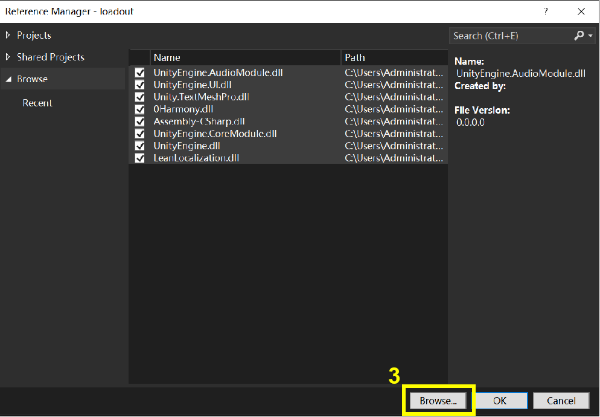

# Patching

This page tells you how to modify functions in the game.

Before you start, make sure you have Microsoft Visual Studio installed on your machine. (Download [here](https://visualstudio.microsoft.com/downloads/))

Download TutorialMod from releases, and open the project with Visual Studio.

## Adding dependencies

Right click on the References at the Solution Explorer view, select Add Reference. If there is not Solution Explorer view, go to View > Solution Explorer to show that view.


Click Browse button to add dependencies.



All needed dependencies are located at `LONESTAR\LONESTAR_Data\Managed` (`LONESTAR` directory can be found in Steam > Library > LONESTAR > Settings > Manage > Browse Local Files), you may need some of the following dll files:

- 0Harmony.dll: About patching.
- Assembly-CSharp.dll: Game assembly.
- UnityEngine.dll
- UnityEngine.CoreModule.dll
- LeanLocalization.dll: About translations.
- Unity.TextMeshPro.dll: About UI.

After adding dependencies to the list, make sure they are ticked, then click OK. Try build the project and it should proceed successfully now. Target dll can be found at `bin/Release/TutorialMod.dll`. You may add other files or 3rd party dependencies anytime you need them.

## The UserMod class
Your assembly should have exactly one class inheriting `UserMod`. See the `TutorialMod` class for example.

```
using HarmonyLib;
using Mods;

namespace TutorialMod
{
    public class TutorialMod : UserMod
    {
        public override void OnLoad(bool autopatch = true)
        {
            base.OnLoad(autopatch);
            UnityEngine.Debug.Log("Successfully Loaded [" + this.modID + "] at " + this.path);
        }
    }
}
```

### void OnLoad(bool autopatch = true)

Called when your mod is loaded. Using `Onload(true)` will automatically load every patching classes in this assembly, as well as other parts like units, treasures, translations, etc. in a predefined order. It's usually enough to use the default `OnLoad` method, but if you want to do something different (Eg. attaching scripts, or only patching part of the assembly), you can do those things within `OnLoad`.

### void OnAllModLoad(IReadOnlyList<UserMod> mods)

Called when all mods are loaded. You may check how many mods are active and what exactly they are. It's OK to leave blank.

### Some useful fields

Here are some useful fields of UserMod you may use when writing your mod.

- assembly (Assembly): A reference to this assembly.
- harmony (Harmony): The Harmony instance used to patch your mod.
- path (string): Full path to the root directory of your mod.
- modID, displayName, version, author (string): Info about your mod. (Defined in your `mod.json`)
- is_dev (bool): Whether this mod is located in the `dev` directory.
- order (int): The order your mod is loaded. Smaller order loads first.

## Writing patches and adding new abilities

### Changing game logic

There is an example of how to write patches in `Patch_WantedProcess` class. To learn more about Harmony patches and annotations, please refer to [Harmony docs](https://harmony.pardeike.net/articles/intro.html).

### Adding new content

Refer to the classes `Skill_CustomAbility` and `Skill_Animated` to learn how to add new abilities to your units. 

Note that most event triggers are caught by the corresponding interfaces. Some interfaces catch very similar behaviors, but have differences on timing. Take battle start effects as an example: Unit upgrades triggers at IBattleStartPre (Upgrade Device), slot addition triggers at IBattleStart (Eternal Slot), while slot degrading triggers at IBattleStartEnd (Breakthrough). So these effects will always trigger in order regardless of their positions on the ship.

## Building and adding your .dll to your mod

Build your project in Release mode, and the target dll will be found at `bin/Release/YourModName.dll`. Add target dll along with 3rd party dependencies (if any) to the root directory of your mod. (Name of the dll doesn't matter.) **Do NOT add any dlls that already exist in the game**. Launch the game and your patches should work now.