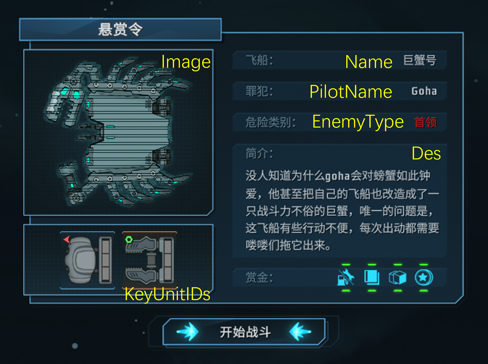
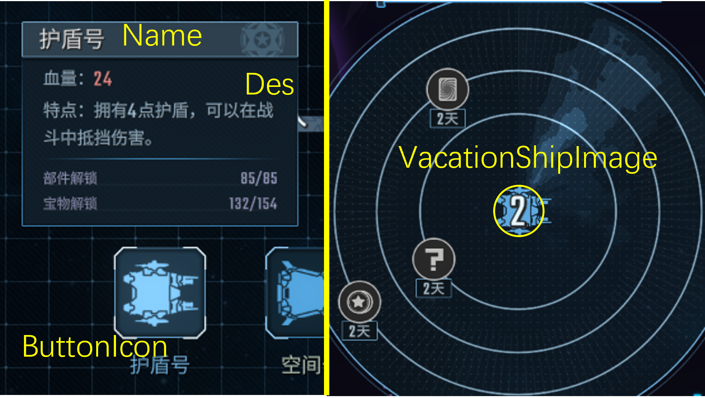
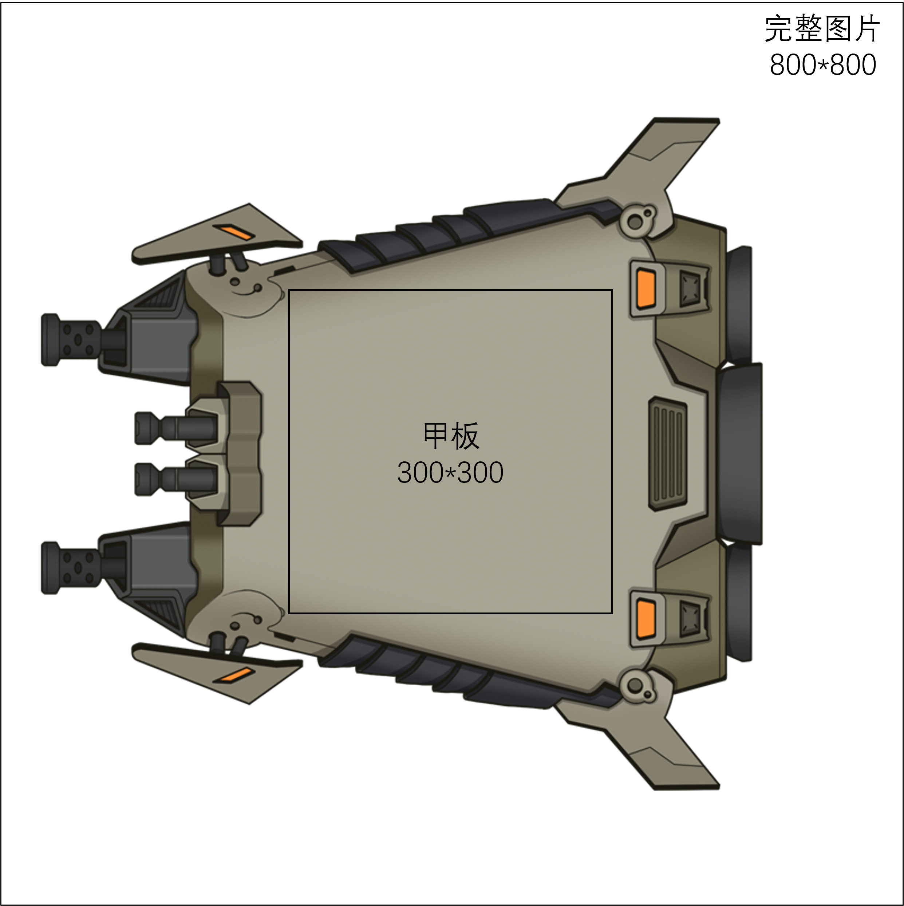

# 飞船
简体中文 [English](Ship_EN.md)

本文主要介绍如何制作玩家或敌方飞船。如果你还没读过[部件教程](ShipUnit.md)，请先阅读那篇文章。

## 敌方飞船

与部件等其他内容相似，你可以通过CSV创建飞船。

- 文件: Content/EnemyShip.csv
- 示例: LockShip

敌船参数：

- ID: 标识符，在你的模组范围内必须是唯一的
- Name/Name_: 敌船名字
- Image: 悬赏令页面显示的敌船图片
- PilotName/PilotName_: 敌方驾驶员
- UnlockLV: 遭遇此敌人所需的协会等级
- Des/Des_: 敌方描述
- HP(_1): 生命值。后缀对应难度：难度0(HP)，难度>=1(HP_1)
- BreakCount(_1): 耐久度。后缀对应难度(4-/5+)
- EnemyType: 威胁等级。爪牙1，精英2，首领3
- EnemyPhaseType: 决定敌船对应阶段的代码，如下表：

| | 爪牙     | 精英   | 首领    |
| --------| -------- | -------- | -------- |
|第一幕 | 1 | 11 | 101 |
|第二幕 | 2 | 12 | 102 |
|第三幕 | 3 | 13 | 103 |

- BackgroundPath: 第1/2/3幕战斗的背景分别为Battleground_1/2/3
- ShipDataPath(_1/2): 敌船部件及AI，看[部件与AI](#ai)部分。后缀对应难度(2-/3-6/7+)
- KeyUnitIDs/KeyUnitLvs(_1/_2): 悬赏令页面现实的部件情报。后缀对应难度(2-/3-6/7+)
- ModPath: 战斗内动效。请看[动画](#anim)部分
- InGame: 设置成FALSE时，不再遇到此飞船
- OnlyPro: 如果设置了值，则只有所列出的飞船能碰到这个敌人，如果留空则都能遇到
- StartYell/EndYell/WinYell: 对话列表。如果设置了值，则会在战斗开始/玩家胜利/玩家失败时从对话列表中随机抽取对话



## 玩家飞船

- 文件: Content/Ship.csv
- 示例: Tiny

参数：

- ID: 标识符，在你的模组范围内必须是唯一的
- Name/Name_: 飞船名字
- Image: 飞船图片。请看[图片](#image)部分
- UnlockLv: 解锁所需的协会等级
- Des/Des_: 飞船描述信息
- Move: 最大燃料
- ShipDataPath: 初始部件。请看[部件](#ai)部分
- PowerCoreWeight: 初始点数能量原料
- PowerColorWeight: 初始颜色能量原料
- BountyEvents: 初始呼叫支援
- ModPath: 飞船动效。请看[动画](#anim)部分
- VacationShipImage: 度假地图中央的小图标。可以与Image相同
    - 飞船需要朝左
    - 只需要Alpha通道，忽略RGB通道。
- InGame: 设置为FALSE时无法选择此飞船开始游戏，但仍可以通过天赋等其他途径获得（例如大船号）
- ButtonIcon: 在飞船选择和百科页用到的图标。可以与Image相同
    - 飞船需要朝左。
    - 只需要Alpha通道，忽略RGB通道。
    - 不需要包括边框和背景
- 标记为Void的域都没有效果。


## 图片和动画

### 图片 <a id="image"></a>

Image是飞船的静态图片。

飞船图片必须**朝左**，游戏内会自动翻转玩家飞船。


飞船甲板的大小必须和部件大小匹配。部件大小是100\*100像素，所以如果你的飞船是3\*3格，那么甲板的大小就是300\*300像素。这并不是说整个图片的大小是300\*300，因为机翼和尾焰也会占用图片面积。



（可选）如果你给boss敌人设置了自定义外观的话，可以给boss设计一个图标，用于在胜利结算页面显示。这个图标的文件名以`_icon`结尾。例如Image设置为 Path/Test.png 的话，则图标为 Path/Test_icon.png。推荐大小为180\*180像素。

### 动画和预设组件<a id="anim"></a>

你可以在表格中的`ModPath`列设置动画。在`ShipData`文件夹中添加一个json文件，然后将文件名填入CSV表格的`ModPath`列。

json文件大概长这样：
```
{
    "image": "Tiny.png",            // 静态图片，如果没有则使用CSV表格中的Image
    "animation": "Tiny/Tiny.scml",  // Spriter 动画。如果没有则使用静态图片
    "components":{
        // 尾焰，飞行轨迹，中心坐标校准等
    },
    "laser": "LaserFogPurple"       // 默认激光外观
}
```

你可以在`components`中加入装饰性尾焰和轨迹（可选），以及中心坐标校准（强烈推荐校准）。每个组件的格式如下：

```
{
    "type": "jet_fire",           // 类型
    "pos" : {"x": 542, "y": 270}, // 坐标
    "norm": {"x": 1, "y": 0}      // （仅尾焰）方向向量，x>0朝右，y>0朝上
}
```

- type: 类型
    - 尾焰："jet_fire", "jet_burn", "jet_ghost", "jet_air"
    - 战斗内飞行轨迹（移动时显示）： "movingtrailspot"
    - 战斗外飞行轨迹（挂机时显示，仅玩家）: "movingtrail"
    - **中心坐标校准**: "Center"
- pos: 坐标
    - 尾焰和飞行轨迹的发射源坐标
    - 使用PS或其他工具在图片中找到坐标
    - 可以用[这张图片](../images/calibrator.png)预览飞船上部件的位置，然后找到飞船中心的坐标，如图
    - 如果没有校准中心坐标，则使用图片的中心作为飞船中心。


## 部件和AI <a id="ai"></a>

在`ShipData`文件夹中添加一个json文件，然后将文件名填入CSV表格的`ShipDataPath`列。这个json文件不同于外观文件，它包含了飞船的部件和AI信息(AI信息仅敌船)。这个json文件大概长这样：

```
{
    "units": [
        [..., ..., ...],  // 上列部件
        [..., ..., ...],  // 中列部件
        [..., ..., ...],  // 下列部件
    ],
    "moves": "USSDSS",    // (仅敌人) 移动方向
    "alerts": "NYNNYN",   // (仅敌人) 预警轮次
    "controller": ""      // (仅敌人) 飞船AI类
}
```

- units: 部件矩阵，从上往下，从前往后排列。如果你的飞船朝向左边，则飞船上的部件与这些的字符串的位置一一对应。
    - 每个字符串的格式 `[<Annotation>]<UnitID>|<UnitLv>:<EnergySequence>`
    - `<Annotation>`: "C"标记这个格子是飞船中心（如果没有则自动选定）；"!"表示这个部件有下回合装载提示（例如玄武号的建造装置）
    - `<UnitID>`: 留空""表示这是空格子，"-"表示此格不可装备部件（例如大船号），可以装备本体部件或mod部件。
    - `<UnitLv>`: 部件等级，默认为1级
    - `<EnergySequence>`: 一个字符串表示敌方如何装载这个部件
        - "2, 3, 44" 表示敌方将在第1/2/3回合装载2点/3点/两个4点，然后循环。
        - 可以用"OBW"指定能量的颜色，没有指定的话，默认颜色是橙色。
        - "2W3, " 表示敌方将依次装载橙色2和白色3，仅奇数回合装载。
        - "B1O1U" 表示敌方每回合将依次装载蓝1，橙1，并使用(U)部件的发动能力。
        - 由于历史原因，不支持多色能量，如果要装载多色能量，可以使用`controller`或使用自动装载多色能量的部件来代替AI装载。
    - 可以参考TutorialMod里面的`ShipData/Locker.json`。
- moves: 一个字符串，表示敌方将向上(U)，不动(S)还是向下(D)
    - 例如"USSDSS"表示敌方将在第一回合向上，接下来两回合不动，第四回合向下，不动两回合，然后循环。
- alerts: 预警轮次（显示在耐久度左侧的红色感叹号标志），跟上面类似。Y/N表示预警开启/关闭。
- controller: 如果你的飞船拥有其他复杂行为，只需要继承`AIShipController`类然后把类名写到`controller`里面。具体写法可以参考秩序号的AI。

下一节：[修改代码](Patch.md)