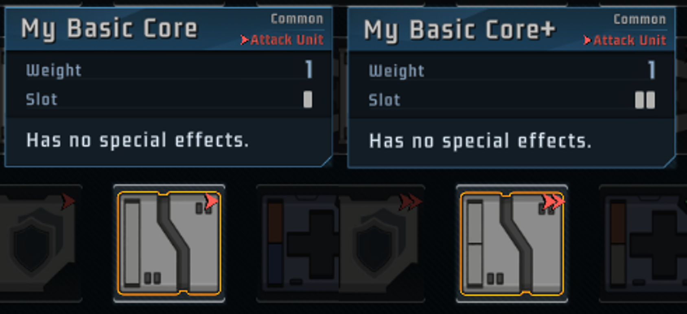
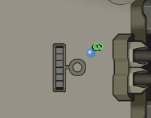
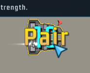

# 部件

简体中文 [English](ShipUnit_EN.md)

本文介绍如何添加部件或修改已有部件，所有示例均可在`TutorialMod`中找到。

## 示例A: 从基础核心开始

在`Content`目录中添加`ShipUnit.csv`，文件结构如下：

```
└─TutorialMod
    ├─Content    
    │   ├─ShipUnit.csv
    │   └─...(Other Files)
    ├─Animations
    ├─Images
    └─...(Other Files)
```

`ShipUnit.csv`中的每一行代表你添加的一个部件。建议使用Excel等表格编辑工具来编辑这些文件。但是有些CSV编辑器可能会造成编码错误。如果你遇到编码错误，可以尝试把这些CSV文件保存为UTF-8格式

把`TutorialMod`中对应文件中的`unitA`的两行粘贴到CSV文件中，这样就完成了基础核心的制作。这个部件目前还没有特殊效果，但我们后续能添加更多内容。



需要注意的是部件的ID。孤星猎人使用`ID`和`modID`的组合来确定一样物品。也就是说不同模组的部件可以使用相同的`ID`，因为它们的`modID`不同。但是同一个模组中的部件和宝物不能使用相同的`ID`，因为它们指代了不同的东西。

modID和ID必须是字母，数字和下划线的组合，即`[_0-9A-Za-z]+`。但纯数字类型的ID（例如"114514"，"1919810"）被本体游戏占用，不要出现在你的模组中。

## 示例B: 添加文本翻译以及修改效果参数


`unitB`是一个带翻译文本的部件。你可能注意到了CSV表格中有些字符串类型的域有两个版本，例如`Name`和`Name_`都能指代部件的名称。你可以把`Name`留空然后用`Name_`为所有语言命名你的部件（例如`unitA`），也可以设置`Name`并为每个语言单独编写翻译文本（例如`unitB`）。参阅[翻译](Translation.md)部分。


请注意，所有模组共享翻译键（这不同于ID）。为了避免冲突，建议将modID添加到你的键（Key）中，简化起见你可以使用"@"来指代你的modID。例如在TutorialMod中，"@" = "TutorialMod"

即使没有代码，你也可以把本体游戏中已经存在的效果添加到你的部件中，例如要使用三棱核心的效果，只需要把`SkillPath`设置为`Skill_TrianglePowerCannon`即可。如果你想修改三重时获得的功率，可以修改`Args`域。

## 示例C: 添加自定义效果


`unitC`是拥有独特效果的部件。你可以把`SkillPath`设定为新效果，然后在`.dll`文件中添加具体实现（参阅[补丁](Patch.md)部分）

### ID命名法<a id="IDNaming"></a>

有些时候你的部件描述需要涉及其他部件，例如`unitC`的描述中就提及了三棱核心。如果要提及本体部件，使用`<UNIT>ID|Lv</UNIT>`即可。如果要提及mod部件，也可以使用相同的结构，只不过略有变化：`<UNIT>modID.ID|Lv</UNIT>`。后续的许多内容中都涉及关于ID引用的问题。为了统一起见，这里约定如何使用字符串引用本体游戏或任意模组中的任意物品：

- 如果字符串是纯数字，则代表本体游戏中的物品
- 如果字符串是`<modID>.<nameInMod>`的格式，则代表对应模组中ID为`nameInMod`的物品
- 其他字符串代表本模组中的物品。

### 改变外观

言归正传，如果想改变部件的外观，例如想使用填补装置的外观，可以把`SpritePath`设置为填补装置的对应项（"device_equip_cannon"）；如果留空，则你的部件将使用默认的部件外观。在下一个例子中将展示如何使用自定义外观。

## 示例D: 使用部件动画



`unitD`是一个带有动画效果的部件，包含自定义的静态外观和动画效果。

`SpritePath`是你的部件以物品形式出现时的静态外观。（例如出现在物品栏或随机奖励中时）如果想要使用自己的外观，在`Image`目录下添加**100x100**大小的图片文件，然后在`SpritePath`使用相对路径引用你的图片，即可使用静态外观。

`AnimPath`是你的部件出现在飞船上时使用的动画效果。孤星猎人支持Spriter动画。（[链接](https://brashmonkey.com/download-spriter-pro/)）把Spriter动画项目放在`Animation` 目录下，然后在`AnimPath`使用相对路径引用你的动画，即可使用动态效果。


默认情况下，部件会播放`default`实体的第一个动画。如果你的部件有槽，建议把槽所在的图层放在最下面，（这个图层在悬停时有一个特殊的发光效果）


在一些事件触发时，也可以播放特殊的动画。（需要编写代码）`Skill_Animated`类演示了如何在装载能量时播放一套新的动画。


## 补充说明：存储特殊数据

大部分常用功能都能在被解包的游戏文件中找到，不过本体游戏中并没有类似杀戮尖塔中仪式匕首之类的部件成长。如果你想存储一些跨战斗保留的特殊数据（例如成长计数），可以将数据存储在`UnitData.args`里面。

## 修改已有部件

你也可以编写代码来修改已有的部件。例如下面的代码让四爆核心的效果只需要3个手牌能量即可触发。这个改动对所有游戏中，等级1的所有四爆核心起效，并且持续到**游戏退出为止**。
```
DataShipUnitManager.Instance().GetDataByID(11004).Args[0] = 3;
```

以下改动将禁用所有等级的配装机直到游戏退出。注意不要直接删除本体游戏中的部件，因为这可能会损坏一些历史记录的存档。至于模组中的部件，这些部件有坏档保护，可以自由删除。

```
DataShipUnitManager.Instance().GetDataListByID(21849).ForEach(data => { data.InGame = false; });
```

## 每个域的详细解释
- ID: 在你的模组中必须是独一无二的。同一个部件的升级和未升级版本共用一个ID。
- Name/Name_: 部件名称。
- Lv: 1代表未升级，2代表已升级，如果你的部件允许多次升级，也可以为3+
- UnlockLv: 解锁等级。这个等级是飞船的等级而不是协会等级。飞船等级在游戏中不显示，范围是0-10。0代表初始解锁
- Rare: 0/1/2分别代表普通，稀有和传说等级
- SkillName/SkillName_: 在能力触发时显示的文本，如下图的黄色"Pair"字



- Genera: 部件的子类别，用于检索特定子类的部件（例如超频部件的`Genera`列表中包含5，所以它们会出现在超频扭蛋机的随机奖励中。）
- InGame: 设置为False时，禁用\*此部件
- GainType: 
    - 0: 正常
    - 1: 只能从商店里买
    - 2: 只能从事件里拿（例如连锁核心）
    - 3: 只能从天赋里刷（例如腐化槽位）
    - 4: 初始部件（例如变色装置）
    - 5: 无法获取（例如21点控制器）
- Pros: 哪些飞船能获得这个部件
- PowerSlot: 一个列表，每个元素代表一个槽位的颜色，0/1/2分别代表白/蓝/橙槽
- CountOffset: 默认情况下，普通/稀有/传说部件每局游戏只能获得3/2/1次，之后就不再出现在随机奖励中。设置CountOffset为X/-X来增加或减少这个部件的获取上限。（获取上限不会影响出现概率）
- WeightOffset: 默认情况下，相同稀有度的部件出现在随机奖励中的概率相同。设置WeightOffset为X/-X来让这个部件出现得X%更频繁/更不频繁。
- EquipLimit: 部件负载
- Description/Description_: 部件描述。关键词需要用"*"括起来，例如 `*超频*(6): 获得*威力翻倍*`
- Properties: 部件上场时自带的增益效果。例如`US:1`代表发动(1), `PA:2`代表2功率等等。你也可以使用代码来加载增益效果。
- Args: 效果的参数，同时也会替换描述中的占位符。例如`获得{0}*功率*和{1}威力`会用Args序列中的前两项代替这两个占位符。
- ExtraDes/ExtraDes_: 特殊字段，例如回合能量装置的提示文本。


- Type: 攻击部件是1，辅助部件是2
- SkillPath: 效果的类名
- SpritePath: 当部件以物品形式出现时的静态外观。留空以使用默认外观。
- AnimPath: 当部件装备在飞船上时的动画外观。留空以使用静态外观。

\*禁用：禁用：这个部件不能出现在商店或者随机奖励中，也不会出现在图鉴里。但可能出现在事件的固定奖励中，也有可能出现在历史记录中。