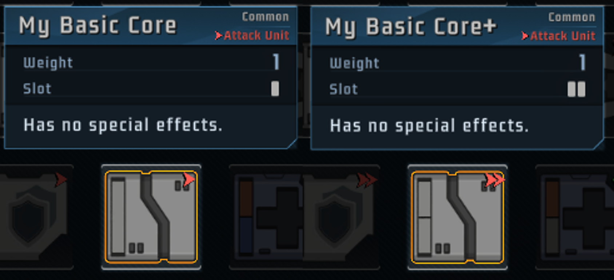
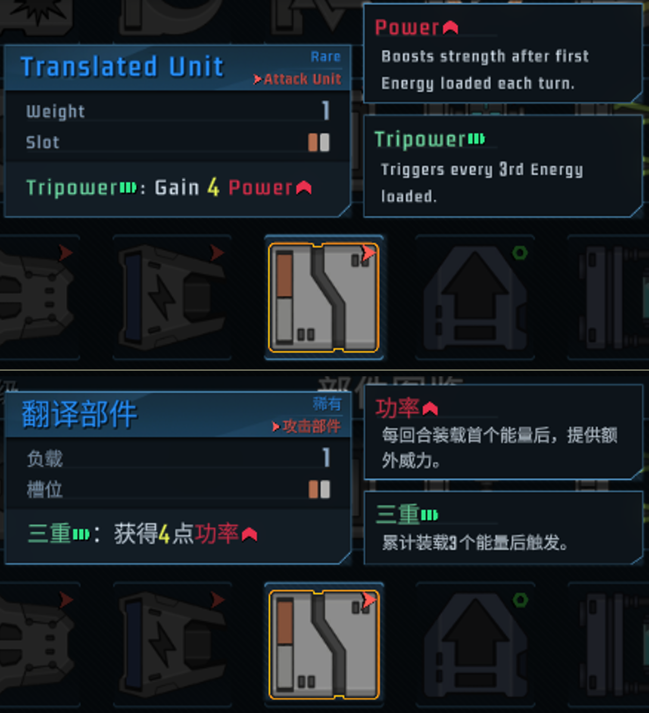
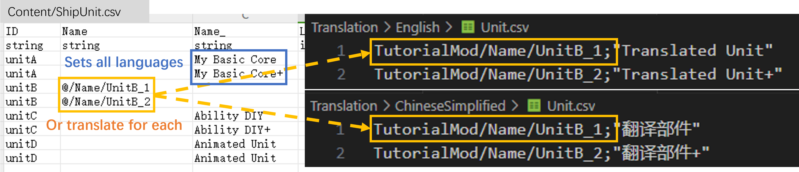
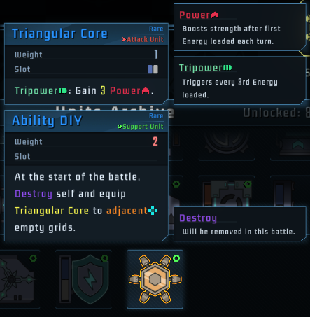
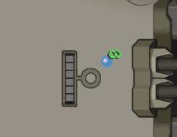
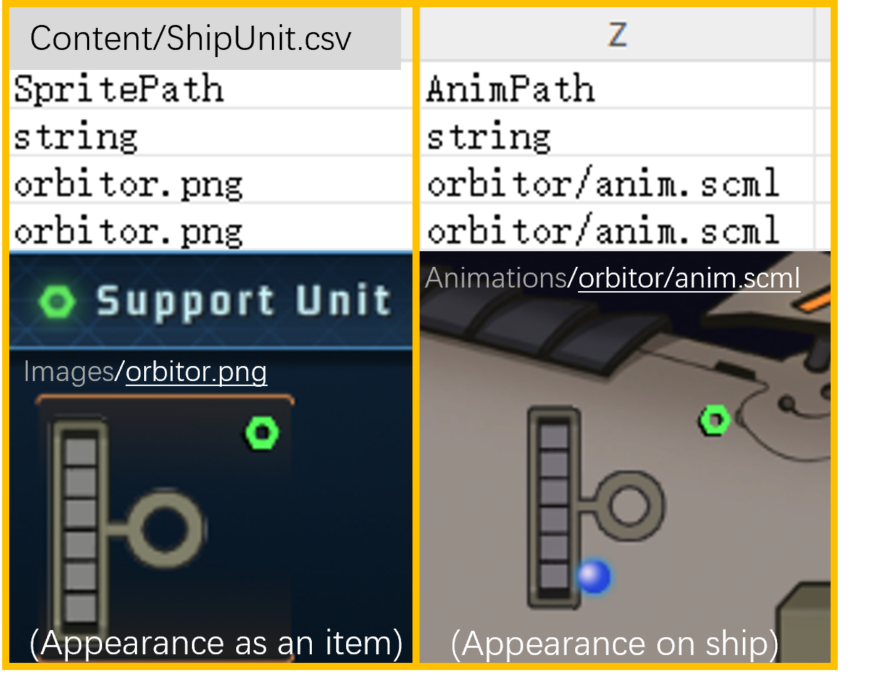
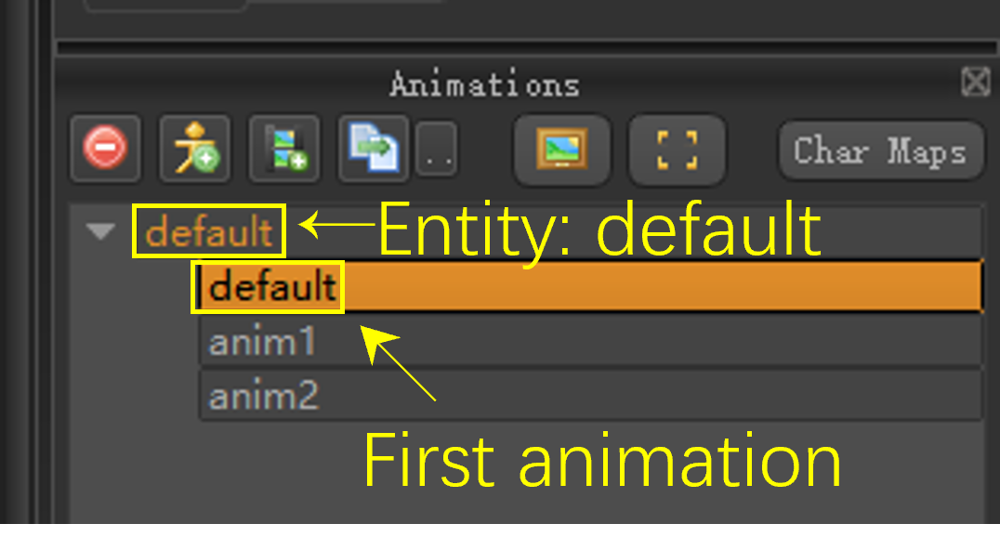
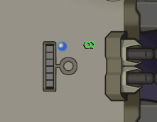
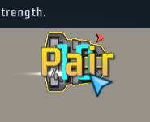
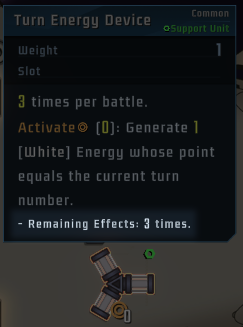

# Unit

This page tells you how to add new units or modify existing units in your mod. All the steps can be found in `TutorialMod`.

## Example A: Starting from a Basic Core

Add `ShipUnit.csv` to `Content` directory. As seen in the file structure below.

```
└─TutorialMod
    ├─Content    
    │   ├─ShipUnit.csv
    │   └─...(Other Files)
    ├─Animations
    ├─Images
    └─...(Other Files)
```

Each line in `ShipUnit.csv` represents a new Unit you add. It's advised to use csv editors like MS Excel instead of plain text editors like notepad. However, some csv editors may cause encoding issues. If you encounter any encoding issues, try change the encoding to UTF-8.

Create your first unit by copying 2 rows of `unitA` in `TutorialMod``. Each row represents a level of a unit. This unit does nothing, but we can add more things later.



Note: LoneStar uses the combination of `ID` and `modID` to identify an item. That means units from different mods can share a same `ID` (their mods are different), but treasures and units in a same mod can't have the same `ID` (they refer to different things).

## Example B: Translating Your Unit & Modifying Parameters



`unitB` is a unit with translated texts. You may notice that some string fields have two versions. Take `Name` for example: you may leave `Name` blank and fill in `Name_` to set your Unit name for all languages (see `unitA`), or set `Name` and add translation to each language respectively (See `unitB`). See Translation part for more info.



Notice that all mods share translation keys (which is different from ID). To prevent conflicts, it's recommended to add modID to your translation keys. You may use "@" to refer to your modID. (In this case "@" = "TutorialMod")

Even if you write no code, you may paste existing effects to your units. To use the ability of Triangular Core, set `SkillPath` field to `Skill_TrianglePowerCannon`. If you want to modify the amount of Power when TriPowered, set `Args` field accordingly.

## Example C: Adding Cool Abilities & Referencing Other Units



`unitC` is a unit with some cool effects. You may set `SkillPath` to a new ability, and implement it in your `.dll` file. (See Patching part for more info)

Sometimes your units may refer to another unit. To reference a vanilla game unit in description, use `<UNIT>ID|Lv</UNIT>`, to reference a modded unit, use `<MODUNIT>modID|ID|Lv</MODUNIT>`. Units should not reference themselves or create a reference loop.

To use the appearance of an existing unit, (Eg. Patch Device), set `SpritePath` to that of the target unit (`device_equip_cannon`). If left blank, your units will use a default sprite instead. You may also create your own in the next example.

## Example D: Animate Your Units



`unitD` is a unit with some animations.

`SpritePath` is the static image of your units when they appear as an item. (In your inventory, as a reward, etc.) To use your own image, add images of size 100x100 to the `Image` folder and reference them in `SpritePath` field.

`AnimPath` is the animation when your units are equipped on the ship. Lonestar supports Spriter animations. (Get Spriter [here](https://brashmonkey.com/download-spriter-pro/) for free). Put your Spriter animation files into `Animation` folder and reference them in `AnimPath` field. 



By default, units play the first animation of entity `default` in their animation files. If your units have slots, make the layer with slots the bottommost layer. (The layer with slots has a special glowing effect when hovered, and by default is the bottommost layer. )



You may also play a different animation when an event triggers. The `Skill_Animated` Class gives an example of how to change the animation when energy is loaded.



## Modifying existing units

You may modify existing units with code. Eg. The following line makes Quadra Burst Cores require only 3 energy in hand instead of 4.
```
DataShipUnitManager.Instance().GetDataByID(11004).Args[0] = 3;
```

This removes Equipping Machine from the pool until game exits.

```
DataShipUnitManager.Instance().GetDataByID(21849).InGame = false;
```

## Detailed Explanation of Each Field
- ID: String. Must be **unique** in your mod. Upgraded units share the same ID with their downgraded version.
- Name/Name_: Name displayed at the title.
- Lv: Can be 1 or 2. (or 3+ if your unit can be upgraded multiple times). 
- UnlockLv: 0 to always unlock, or unlocks at the set ship Lv (Ship levels up from 0 to 10. Ship level is hidden in game and different from association Lv)
- Rare: 0 for common, 1 for rare, 2 for legendary.
- SkillName/SkillName_: Allows showing text when ability is triggered.



- Genera: Categorize some units to smaller groups for tag searching. (Eg. Overclock units have tag 5 in their genera list, so they can appear in the "overclock gacha machine" event. )
- InGame: Leave blank. Or set to FALSE and remove them from random rewards, but they may appear as a fixed reward of an event. 
- GainType: Zero for gainable units. Units of non-zero `GainType` can't be found in random rewards, but may appear as a fixed reward of an event. 
- Pros: Specifies which ship(s) can get this unit. (7 for Shielder and 77 for Spacewalker.)
- PowerSlot: List of color slots. 0 for White, 1 for Blue, 2 for Orange.
- CountOffset: By default, Common/Rare/Legendary units have 3/2/1 copies in the universe. Set CountOffset to 1/-1 to add/remove a copy.
- WeightOffset: By default, units of the same rarity have the same possibility to appear in random rewards. Set WeightOffset to 30/-30 make them appear 30% more/less frequently.
- EquipLimit: Unit weight.
- Description/Description_: Unit descriptions. Keywords should be marked with "*", eg. `*Overclock*(6): Gain *Double Strength*`
- Properties: Status effects (Buffs) automatically added when unit equipped. (Eg. `US:1` for Activate(1), `PA:2` for 2 Power, etc.) You may also load status effects with code.
- Args: arguments of ability. And will replace the placeholders in description text. (Eg. Description: `Gain {0} *Power* and {1} strength` will display the first two arguments in `Args` list. )
- ExtraDes/ExtraDes_: Extras description. See Turn Energy Device.



- Type: 1 for Attack Units, 2 for Support Units
- SkillPath: The class name of target ability.
- SpritePath: Image of the unit when they appear as an item. Or leave blank to use a default image.
- AnimPath: Animation of the unit when they appear on the ship. Or leave blank to use SpritePath as static image when no animation is provided.