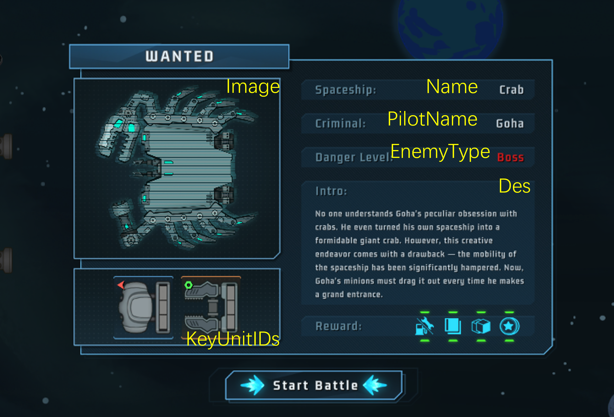
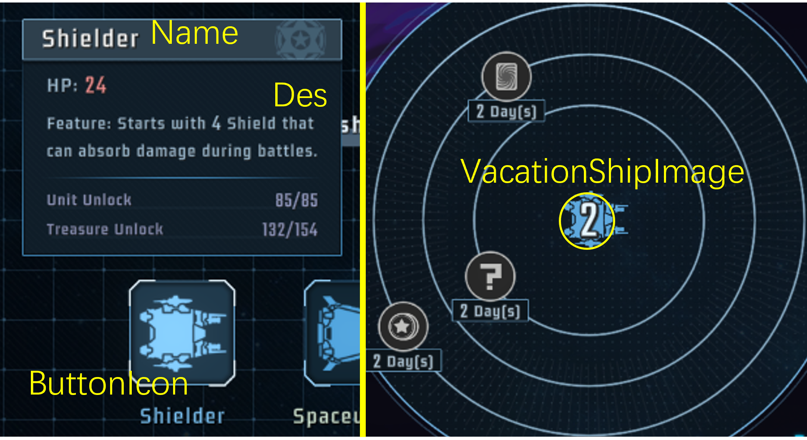
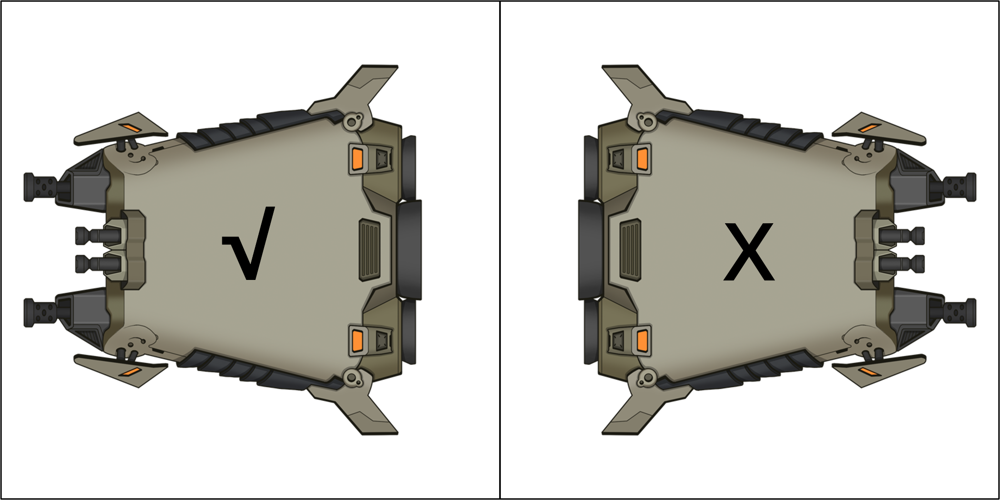
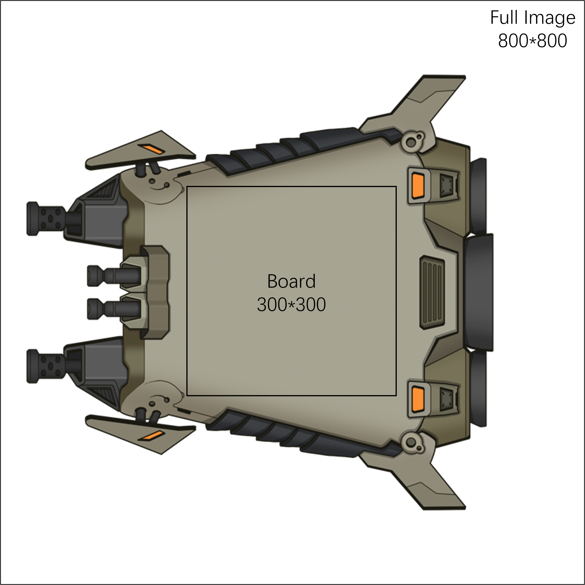
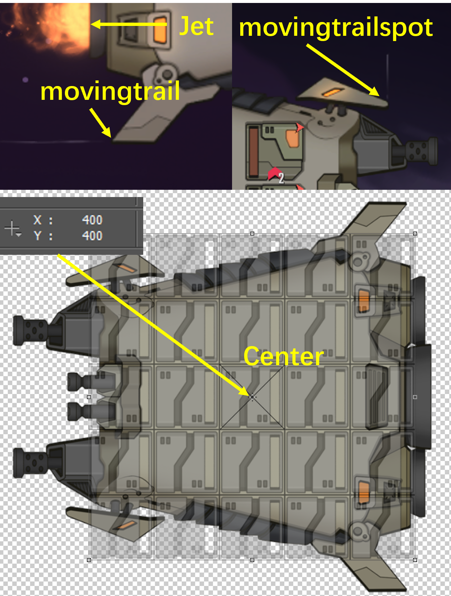

# Ship
[简体中文](Ship.md) English

This page introduces the necessary steps on making a modded player/enemy ship. If you haven't read [Units](ShipUnit_EN.md), please read that first.

## Enemy Ship

Similar to other contents like Units, you can create a ship using csv. 

- File: Content/EnemyShip.csv
- Example ID: LockShip

Fields:

- ID: Must be unique in your mod.
- Name/Name_: Display name of this ship.
- Image: Image displayed at the wanted screen. See [Image](#image) part.
- PilotName/PilotName_: Pilot name displayed at the wanted screen.
- UnlockLv: Association level required to encounter this enemy
- Des/Des_: Displayed info about this ship.
- HP(_1): ship HP at Difficulty level<=0(HP) or >=1(HP_1)
- BreakCount: Durability at Difficulty level<=4(BreakCount) or >=5(BreakCount_1)
- EnemyType: 1 for henchman, 2 for elite, 3 for boss
- EnemyPhaseType: Code to indicate which stage this enemy belongs to. See the table below:

| | henchman     | elite    | boss     |
| --------| -------- | -------- | -------- |
|Act 1 | 1 | 11 | 101 |
|Act 2 | 2 | 12 | 102 |
|Act 3 | 3 | 13 | 103 |

- BackgroundPath: Battleground_1/2/3 for Act 1/2/3 fights
- ShipDataPath(_1/2): units and AI of the enemy ship. See [AI](#units-and-ai) part. Chosen according to difficulty level: (2-/3-6/7+)
- KeyUnitIDs/KeyUnitLvs(_1/2): List of units displayed at the wanted screen. Chosen according to difficulty level: (2-/3-6/7+)
- ModPath: Appearance during battles. See [Animation](#image) part.
- InGame: Set to FALSE to disable.
- OnlyPro: If set, only ships in the list can encounter this enemy. If left blank, available to all player ships.
- StartYell/EndYell/WinYell: If set, will yell one from the corresponding string when battle starts/player wins/player loses.



## Player Ship

- File: Content/Ship.csv
- Example ID: Tiny

Fields:

- ID: Must be unique in your mod.
- Name/Name_: Display name of this ship.
- Image: Image of this ship. See [Image](#image) part.
- UnlockLv: Association level required to use this ship.
- Des/Des_: Info about this ship.
- Move: Max fuel.
- ShipDataPath: Initial units. See [AI](#units-and-ai) part.
- PowerCoreWeight: Initial point energy resources.
- PowerColorWeight: Initial color energy resources.
- BountyEvents: Initial Call-for-Supports.
- ModPath: Appearance during battles. See [Animation](#animations-and-components) part.
- VacationShipImage: Small icon displayed at the center of the vacation map. Can be the same as Image. 
    - Ship should face left.
    - Only alpha channel needed. RGB channel ignored.
- InGame: Set to FALSE to remove that ship from ship selection screen. (May be obtained with talents like MegaShip.)
- ButtonIcon: Icon used in ship selection screen and encyclopedia. Can be the same as Image. 
    - Ship should face left.
    - Only alpha channel needed. RGB channel ignored.
    - No need to include button frame or background.
- Anything marked as Void has no effect.


## Image and Modpath(Animation)

### Image

The Image field is the static image of your ship. 

The image of ships (both the player ship and the enemy ship) must **face left**. The game will flip the ship according to their side.



The size of ship board must fit in the size of units. A unit or a grid is 100\*100 pixels, so if your ship is 3\*3 grids, its board should be 300\*300 pixels. That does not mean the full image is 300\*300, as other parts like the wings and jets may take up additional area.



(Optional) If you set new appearance for boss enemies, you can add a cool icon to display on the winning screen. The filename should be identical to Image but end with `_icon`. (Eg, if Image is Path/Test.png, then icon is Path/Test_icon.png) preferred icon size is 180\*180 pixels.

### Animations and Components

You can configure animation with ModPath field. Add a json file in `ShipData` folder and copy its name to the ModPath field in the csv file.

The json file looks like this:
```
{
    "image": "Tiny.png",            // Static image. If no image, use the Image field in the csv.
    "animation": "Tiny/Tiny.scml",  // Spriter animation. If no animation, use image as fallback.
    "components":{
        // Jets, flying traces, spaceship center coordinates
    },
    "laser": "LaserFogPurple"       // Default laser skin
}
```

You can add decorative jets and traces (optional) and mark the ship center(highly recommended) in `components`. Each component is represented as follow:

```
{
    "type": "jet_fire",           // Component type
    "pos" : {"x": 542, "y": 270}, // Component coordinate
    "norm": {"x": 1, "y": 0}      // (Jet only) Direction vector
}
```

- type: 
    - Jet: "jet_fire", "jet_burn", "jet_ghost", "jet_air"
    - Flying trace in battle (on move): "movingtrailspot"
    - Flying trace out of battles (when idle, player ship only): "movingtrail"
    - **Spaceship Center**: "Center"
- pos:
    - The position where jets & flying traces are emitted.
    - Pinpoint the coordinate using PS or other tools.
    - Use [this image](../images/calibrator.png) to preview the position of units on the ship, and find the coordinate of the center. See the picture below.
    - If Center not set, will default to image center.



## Units and AI

Add a json file in `ShipData` folder and copy its name to `ShipDataPath` field in the csv file. This json includes necessary information of units on the ship. A template shipmod file is as follow:

```
{
    "units": [
        [..., ..., ...],  // Top lane units
        [..., ..., ...],  // Mid lane units
        [..., ..., ...],  // Bottom lane units
    ],
    "moves": "USSDSS",    // (Enemy only) move direction
    "alerts": "NYNNYN",   // (Enemy only) alert turns
    "controller": ""      // (Enemy only) ship AI
}
```

- units: matrix of units, arranged from top to bottom, front to back. (Fits in the coordinates if the ship faces left)
    - Element format: `[<Annotation>]<UnitID>|<UnitLv>:<EnergySequence>`
    - `<Annotation>`: "C" if this is central grid, "!" if this unit has load notice (Like Construction Device)
    - `<UnitID>`: blank if this grid is empty, "-" if this grid can't equip units (Like mega ship), can use a vanilla unit or a mod unit.
    - `<UnitLv>`: unit level. Default value is 1
    - `<EnergySequence>`: (Enemy Only) a string of how enemy loads the unit. 
        - "2, 3, 44" means this unit will load Energy 2, 3, and a pair of 4 on turn 1, 2, and 3 respectively. Then repeat.
        - Use "OBW" to specify Energy color. Default color is Orange if not specified.
        - "2W3, " means this unit will load an Orange 2 and **W**hite 3 on odd-numbered turns.
        - "B1WO1U" means this unit will load **B**lue 1, [**W**hite+**O**range 1], and **U**se its Activate ability every turn.
    - See `ShipData/Locker.json` in TutorialMod for example.
- moves: a string of **U**p, **S**top, and **D**own, marking the move direction of enemy ship at each turn.
    - Eg. "USSDSS" means the ship will go up at turn 1, stop at turn 2 and 3, go down at turn 4, stop at turn 5 and 6, then repeat.
- alerts: alert turns, similar to moves. Y/N means Alert on/off.
- controller: if your ship has more complex behaviors, implement in a class inheriting `AIShipController` and set `controller` to class name. (Refer to Order)
