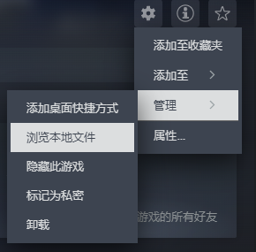

# 基础教程

简体中文 [English](Start_EN.md)

本文主要介绍模组文件的文件结构，制作模组的大致流程，以及一些可能对模组制作有帮助的工具。`TutorialMod`是一个样例，以下很多地方将拿它作为示例。

值得一提的是，编写模组不需要任何编程技术，不过如果你懂一些C#的话，就能制作出更酷炫的效果。

## 哪些东西可以被做进模组
- 添加新语言及翻译（无需代码）
- 添加新内容（部分需要代码）
    - 部件，天赋，驾驶员等
    - 为你的内容添加翻译文本
    - 可以使用本体游戏的效果，也可以制作自己的
    - 为你的部件添加图片或动画，也可以使用本体游戏的
    - 可以修改本体游戏的内容
- 修改游戏逻辑 (需要代码)

## 解包游戏文件（可选）<a id="disassemble-the-game-optional"></a>
如果你需要用到游戏的资源，或者想了解游戏的逻辑，可以先解包游戏文件。有很多开源工具能帮你解包游戏文件。你可以用 AssetRipper （[链接](https://github.com/AssetRipper/AssetRipper/releases)）来提取游戏素材，用 Dnspy（[链接](https://github.com/dnSpy/dnSpy/releases)）阅读和修改游戏代码。

AssetRipper使用方法: File > Open Folder > 选择 `LONESTAR` 文件夹（在steam中选择浏览本地文件，如图）



然后 Export > Export All Files，选择一个空文件夹导出，就大功告成了！

导出的文件结构大概长这样，其中有一些重要文件都标注在下面了。

```
└─ExportedProject
    └─Assets
        ├─Scripts
        │   └─Assembly-CSharp // 游戏代码
        └─Resources
            ├─csv  // 部件，宝物等的数据表格
            ├─sprites // 图片
            └─textmap // 翻译
```

Dnspy使用方法: File > Open > 选择 `LONESTAR/LONESTAR_Data/Managed/Assembly-CSharp.dll` (`LONESTAR`文件夹用上面提到的方法查找)

Dnspy 不能提取资源文件，但它能查阅和修改代码，可能会很有帮助。

## 模组结构
所有模组都位于以下地址：
- Windows：`%USERPROFILE%/AppData/LocalLow/Shuxi/LONESTAR/Mods`
- MAC：`~/Library/Application Support/Shuxi/LONESTAR/Mods`

这是模组文件夹的结构：
```
└─Mods
    ├─Dev  // 开发中的模组，始终启用
    │   ├─Mod1
    │   ├─Mod2
    │   └─TranslationAutoComplete  // 翻译相关
    ├─Local // 手动安装的模组
    ├─Steam // 创意工坊模组
    │   └─TutorialMod  // 示例模组
    └─mod_settings.json  // 配置文件，保存了模组的启用状态等
```

一个模组大概长这样（以TutorialMod模组为例）

```
└─TutorialMod
    ├─Animations  // Spriter格式的二维动画
    ├─Images
    ├─Content  // 部件，宝物等
    │   ├─ShipUnit.csv
    │   └─Treasure.csv
    ├─Translation
    │   ├─English
    │   ├─ChineseSimplified
    │   └─CustomLanguage
    ├─ShipData  // 飞船信息
    ├─mod.json  // 模组的重要信息
    ├─preview.png  // 创意工坊中显示的封面图片
    └─TutorialMod.dll  // 包含模组代码的DLL文件
```

值得一提的是，除了`mod.json`之外的其他内容都是可选的。如果你的模组没有动画或者代码，可以放心删除相关的文件和文件夹。

## mod.json
创建模组的第一步是在`Dev`中新建一个文件夹，然后在子文件夹里面创建`mod.json`。这个文件包含你的模组的一些重要信息。`mod.json`大概长这样：

```
{
    "modID" : "TutorialMod",
    "displayName" : "教程模组",
    "description" : "《孤星猎人》模组教程及示例\n",
    "version" : "1.0.0",
    "author" : "皮皮"
}
```

- modID: (必需) 模组的ID，必须独一无二（字母，数字和下划线的组合即可。不要出现奇怪字符，不然后面很难调）
- displayName: (可选) 显示名称
- description: (可选) 在创意工坊中出现的描述，可以用"\n"换行
- version: (可选) 版本号
- author: (可选) 作者名

如果同一个modID检测到了不同的模组，只有第一个加载的模组起效。而模组加载顺序为 Dev > Steam > Local，也就是说如果你有Dev版本的模组，它就会覆盖steam上的同名版本。

## 测试模组
### 打印调试信息
BepInEx可以在运行时打印调试信息。BepInEx使用方法：下载[BepInEx](https://github.com/BepInEx/BepInEx)，解压到`LONESTAR`文件夹（doorstop_config.ini应该与LONESTAR.exe同目录），运行一次游戏，退出，用记事本打开`BepInEx/config/BepInEx.cfg`，找到如下内容，把其中的`false`改成`true`

```
...
[Logging.Console]

## Enables showing a console for log output.
# Setting type: Boolean
# Default value: false
Enabled = true // 这里的false改成true
...
```

之后运行游戏时就会产生一个即时的窗口打印错误信息。（这里我们只用到了BepInEx的打印功能，不用BepInEx加载模组。）

调试信息`Player.log`也可以在模组文件夹的上级文件夹中找到，但这个文件只有在运行结束时才会刷新。

### 游戏内控制台
控制台模组 `loadout` ([链接](../Loadout)) 提供各种游戏内调试功能，方便测试部件和宝物效果等。它的源码可以在[这里](../Loadout_code/)看到

## 发布模组
在模组界面点击发布按钮以发布模组。建议添加一张预览图`preview.png`，这张图会显示在创意工坊的封面上，供玩家参阅。

如果你想上传动图或者多张封面图，也可以直接在steam创意工坊页面编辑你的mod简介。在这种情况下就不要创建`preview.png`了。（否则它会覆盖掉你在创意工坊页的改动）类似的，如果你要上传大段描述，使用`mod.json`文件可能不方便预览和编辑，这种情况下也可以把`mod.json`中`description`项留空，然后在直接编辑创意工坊页面。

如果这是你首次上传创意工坊内容，将会在steam客户端打开一个链接，里面有一些条款需要你阅读并同意。

有些时候创意工坊模组不会及时更新。所以更推荐低频大量的更新而不是高频少量。此外，更新版本号并附加github链接也有助于玩家更好的了解模组是否是最新。

下一节：[翻译教程](Translation.md)