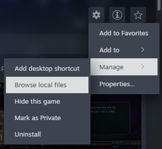

# Getting Started

[简体中文](Start.md) English

This page tells you the file structure of your mod, and introduces the tools you may need to create your mod. A template mod can be found in `TutorialMod`.

Note that you don't necessarily need any coding in your mod, although some advanced features are only possible if you have C# knowledge. 

## What you can mod
- Add a new language and its translations (No code involved)
- Add new contents (Some involves code)
    - Units/Treasures/Talents/Events.
    - Translate descriptions to different languages.
    - Use an existing ability or create your own.
    - Create images for your units, or use an existing one.
    - Add animations to your Units.
    - Modify existing content.
- Modify game logic (Involves code)

## Disassemble the game (Optional)
If you need game assets or want to inspect game code, you may need to disassemble the game first. There are tools that help you on this. You can extract game assets with AssetRipper ([Link](https://github.com/AssetRipper/AssetRipper/releases)) and view code with Dnspy ([Link](https://github.com/dnSpy/dnSpy/releases)).

In AssetRipper: File > Open Folder > Select `LONESTAR` directory (Find the path in Steam, as shown in the picture below)



Then Export > Export All Files, and you get the assets of LoneStar.

Some folders that may help in modding:
```
└─ExportedProject
    └─Assets
        ├─Scripts
        │   └─Assembly-CSharp // Game code
        └─Resources
            ├─csv  // Data for Units, Treasures, etc.
            ├─sprites // Image assets
            └─textmap // Translation
```

In Dnspy: File > Open > Open `LONESTAR/LONESTAR_Data/Managed/Assembly-CSharp.dll` (`LONESTAR` folder can be found in Steam as shown in the above picture)

Dnspy won't extract game assets, but it supports code searching and game logic modifications, which helps a lot in understanding code mechanics.


## Mod Structure
All mods are located in 
- Windows: `%USERPROFILE%/AppData/LocalLow/Shuxi/LONESTAR/Mods`
- MAC: `~/Library/Application Support/Shuxi/LONESTAR/Mods`

The file structure of Mods directory:
```
└─Mods
    ├─Dev  // mods in development, always active
    │   ├─Mod1
    │   ├─Mod2
    │   └─TranslationAutoComplete  // Translation related
    ├─Local // mods installed manually
    ├─Steam // mods from Steam Workshop
    │   └─TutorialMod  // Tutorial mod
    └─mod_settings.json  // List of mods and their activation status
```

The structure of a Lonestar mod: (Take TutorialMod for example): 

```
└─TutorialMod
    ├─Animations  // Animations in Spriter format
    ├─Images
    ├─Content  // Units, Treasures, etc. in csv format
    │   ├─ShipUnit.csv
    │   └─Treasure.csv
    ├─Translation
    │   ├─English
    │   ├─ChineseSimplified
    │   └─CustomLanguage
    ├─ShipData  // Ship info
    ├─mod.json  // Important info of the mod
    ├─preview.png  // Preview image shown in workshop
    └─TutorialMod.dll  // Built from code
```

Note that everything except `mod.json` is optional. If your mod contains no animations or images, it's OK to remove corresponding directories.

## mod.json
Start your mod by creating a subfolder in `Dev` and placing `mod.json` into the **sub**folder. This file contains the information about your mod, and is the only necessary file of your mod. A `mod.json` looks like this: 

```
{
    "modID" : "TutorialMod",
    "displayName" : "Tutorial Mod",
    "description" : "Template and Tutorial Mod for LoneStar",
    "version" : "1.0.0",
    "author" : "pip"
}
```

- modID: (Necessary) ID of your mod, must be unique. 
- displayName: (Optional) Name displayed on the mod screen.
- description: (Optional) Description displayed in workshop.
- version: (Optional) Version displayed on the mod screen.
- author: (Optional) Author displayed on the mod screen.

If multiple mods with the same modID are detected, only the first is used. Note that mods load in the order Dev > Steam > Local. So if you have a dev mod, it will override its Steam version.

## Testing your mod
There are tools that help you debug your mods, like [BepInEx](https://github.com/BepInEx/BepInEx) or [UnityExplorer](https://github.com/sinai-dev/UnityExplorer). They are available in Github.

Also there is a mod `loadout` ([link](../Loadout)) that may help you debug your units. And a mod `TutorialMod` ([link](../TutotialMod) & [Code](../TutorialMod_code)) that is used as an example in this document.

## Publish your mod
Publish your mod by pressing the update button in Mod page. It's advised to include a `preview.png` that is shown on the workshop page. 

If you want to upload multiple preview images or short videos, you can directly edit in your workshop page after the first time you upload your mod. In that case, don't create `preview.png`, or it will override the changes you made in the workshop page. Similarly, if you feel inconvenient to edit long descriptions in `mod.json`, you can leave `description` field empty and edit it directly in your workshop page.

If this is your first time to upload a mod, that should direct you to an agreement page of Steam.

Sometimes the workshop mods are not updated in time. So it's better to make bigger updates in less frequency. Also, updating the version number and adding a github link to description will help players identify whether their mod is up-to-date.

Next Chapter: [Translation](Translation_EN.md)