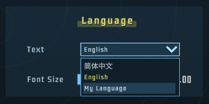

# Translation

This page tells you how to add translations to your mod. All the steps can be found in `TutorialMod`.

## File Structure

Let's begin with the file structure in TutorialMod.

```
└─Tutorial
    ├─Translation    
    │   ├─ChineseSimplified
    │   │   ├─TranslationPart1.csv
    │   │   ├─TranslationPart2.csv
    │   │   └─...
    │   ├─English
    │   │   └─Translation.csv  
    │   └─CustomLanguage
    │       └─Translation.csv
    └─...(Other Files)
```          
The translation files are located in the `Translation` directory. Each subdirectory represents a different language. Lonestar supports two languages: `English` and `ChineseSimplified`, you may also add new languages later on. 

Each subdirectory may have one or multiple `.csv` files, each implementing part of the translations for the corresponding language. The name of the `.csv` file has no effect besides helping you distinguish their content.

Each line in the `.csv` file should be in the following format:
```
<Key>;"<Value>"
```
Eg. 
```
YourModName/Unit/YourUnitName;"Modded Core"
```

Note: It's recommended to use a plain text editor instead of MS Excel. Since Excel may cause formatting or encoding issues. If you run into some encoding issues, try changing the encoding into UTF-8.

## Add a new language

Create a new directory `CustomLanguage` in `Translation` directory and add your first translation file `Translation.csv`. Write the following text to `Translation/CustomLanguage/Translation.csv`

```
LanguageCommon/CustomLanguage;"My Language"
```

or the general format:

```
LanguageCommon/<LanguageID>;"<LanguageDisplayName>"
```

The above line tells Lonestar to add that language to the language selection dropdown. Where `<LanguageID>` should be identical to the directory name you just created. **Run Lonestar** and the new language is found in the settings screen.



After running the game, Lonestar creates a directory named `TranslationAutoComplete` in the `Mods/Dev` directory, which contains lists of missing translation texts. The next step is to translate the texts from English to your new language and **add them to your `.csv` files**. (Modifying files in `TranslationAutoComplete` has no effect. They will refresh every time you launch the game.) 

It's OK if you don't fully implement your language, but it's recommended to do so. Since any untranslated text will fallback to English during runtime. 

## Modify/Implement existing translations

The steps are quite similar to adding a new language. Add a `.csv` file to `English` or `ChineseSimplified` and write your translation. 

Note that you may even translate your texts into another different language, even if they only exist in another language mod. As long as `LanguageCommon/<LanguageID>;"<LanguageDisplayName>"` doesn't exist, that language won't appear in the language selection. That means your translation will take effect iff the target language mod is active.
